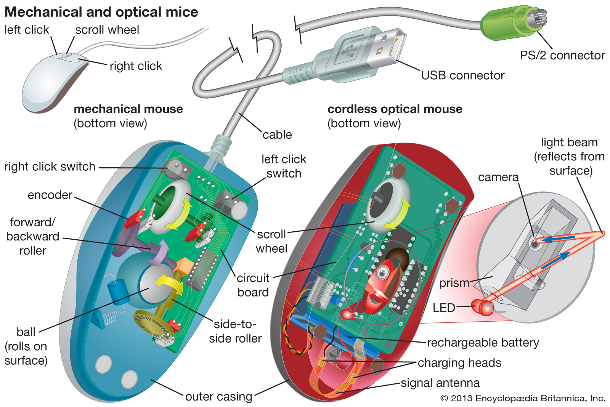
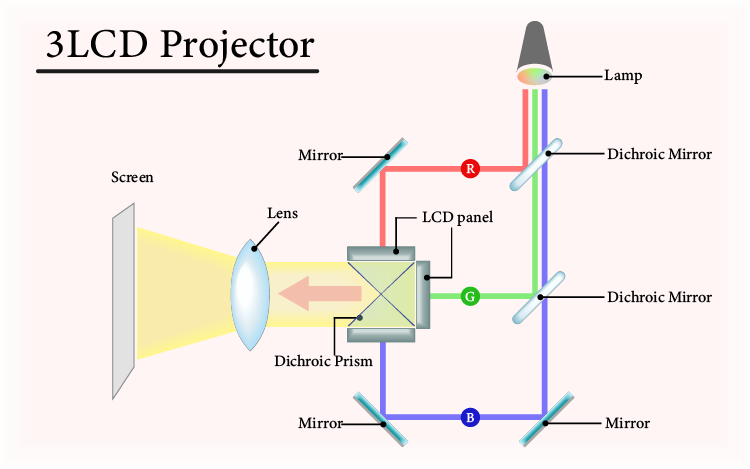
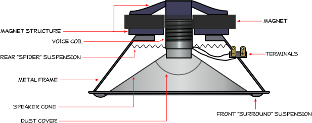
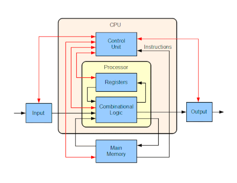
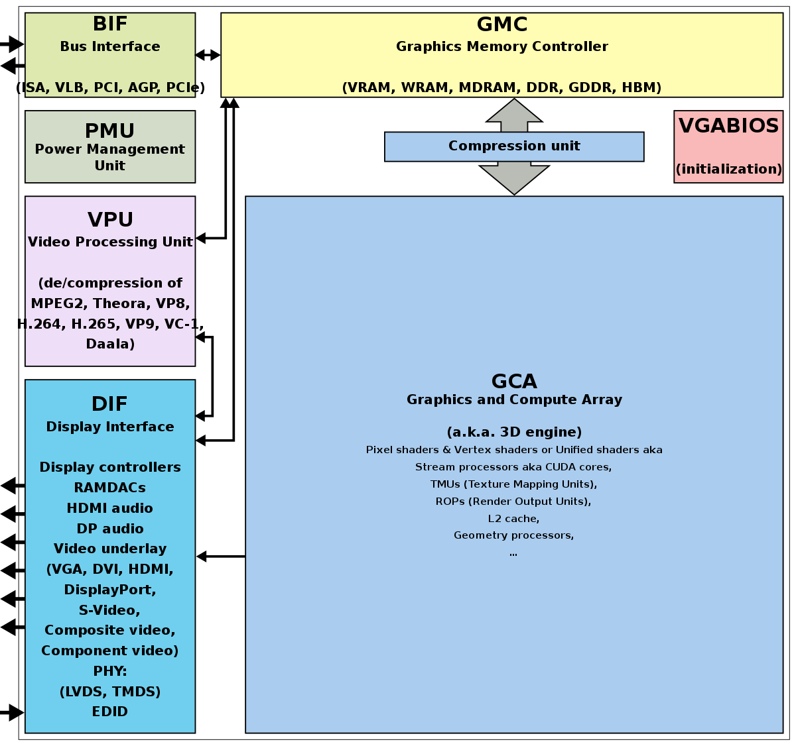
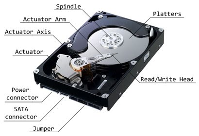

# Hardware tutorial handbook

## Table of contents:

- Input
    - Mouse
    - Keyboard
- Output
    - LCD Data Projector
    - Speakers
- Processors
    - CPU
    - GPU
- Storage
    - HDD
    - RAM
- Trends

## Input

### Mouse
- Diagram
    -  [1]
- Definition
    - How to use it:
        - There are many features to a mouse; like moving the cursor, accomplished by moving the physical mouse, left and right clicking, accomplished by depressing the left or right mouse buttons. Scrolling up or down a page, like on a web page or text document, is done by rolling the scrollwheel in the middle.
    - What it does:
        - translates movement along a surface to movement of the cursor on a computer, and presses of LMOUSE and RMOUSE to left and right clicks, and movement of scrollwheel to scrolling. Sometimes includes other buttons for macros, which are user-decided functions.

### Keyboard
- Diagram
    - 
- Definition
    - How to use it:
        - Depress a key to send the labled letter or command to the computer connected to it, for example, pressing the 'P' key will type a 'p' in a word prcessor, or could accomplish something else depending on the program.
    - What it does:
        - Each key is it's own key switch  that when depressed, sends a signal to the control chip inboard the keyboard, which then sends it to the computer it is connected to.

## Output

### Data Projector
- Diagram
    -  [3]
- Definition
    - How to use it:
        - To use a product like this, you must have:
            1. A computer or device to output video
            2. Some sort of cable to transport the video, there are different cables that allow for different quality.
        - To use it you:
            1. Plug the cable into both the Output device and the plasma screen
    - What it does:
        - One lamp projects light into Dichronic mirrors tha separate the light into colours, then these colours are reflected into LCD screens that change the brightness, then theese streams are combined using a prism

### Speaker
- Diagram
    -  [4]
    -  [5]
- Definition
    - How to use it:
        - To use a product like this you must have:
            1. A computer or device to output video
            2. A speaker
        - To use it you:
            1. Plug the Audio Cable attached to the speaker into the output device
    - What it does:
        - Wattage into the speaker goes through a copper cable surrounding a ring inside a magetised ring, and outside an oppositely magnetised pole. This causes the ring to move up and down, moving a diaphragm which moves the air in sound waves.

## Processors

### CPU (Central Processing Unit)
- Diagram
    -  [6]
- Definition
    - How to use it:
        - Commands for the CPU are stored in RAM (Random Access Memory), and are usually used by applications to get the cpu to do calculations.
    - What it does:
        - It makes simple calculations at extremely quick speeds, depending on the hertz of the processor, 1Hz is one calculation per second, 3GHz is approximately 3 billion calculations per second.

### GPU (Graphics Processing Unit)
- Diagram
    -  [7]
- Definition
    - How to use it:
        - Similar to the CPU, Commands for the GPU are stored in the RAM, but the GPU is faster, as it is used by applications to calculate graphics. it is therefore mainly used by games, or if you want some extremely fast calculations done.
    - What it does:
        - Makes simple calculations at quicker speeds than the CPU, again depending on the Hertz.

## Storage

### HDD (Hard Disk Drive)
- Diagram
    -  [8]
- Definition
    - How to use it:
        - to interface with a Hard disk drive, you connect it to a computer, via the plug connection on hte side, then the operating system should recognise it and allow you to interperet the date stored on it.
    - What it does:
        - Hard disk drives store data with magnetism, magnetising and demagnetising tiny sections on the large disc in side the hard drive, the Platter. these strings of magnetised and demagnetised sections represent bits, and come together to represent binary strings. these can then be interpereted into text, or images, or anything else you can see or hear on a computer.

### RAM (Random Access Memory)
- Diagram
    -  [9]
- Definition
    - How to use it:
        - RAM is used whenever doing anything on a computer. When opening an executeable, the core files of said program are stored in RAM for faster access, and anything else you do is also stored there.
    - What it does:
        - RAM ,or Random Access Memory, is memory used for the task at hand, and requires the computer to be on to store data. The purpose, and namesake of this device is to be used as fast as possible at any time (__Random__ Access memory).

## Trends

## References

[1]: Encyclopedia Britannica. 2020. Computer Peripheral | Definition & Examples. [online] Available at: <https://www.britannica.com/technology/input-output-device> [Accessed 11 March 2020].

[2]: 

[3]: En.wikipedia.org. 2020. Plasma Display. [online] Available at: <https://en.wikipedia.org/wiki/Plasma_display# /media/File:Plasma-display-composition.svg> [Accessed 11 March 2020].

[4]: Centerpointaudio.com. 2020. How Speakers Work. [online] Available at: <http://www.centerpointaudio.com/howspeakerswork.aspx> [Accessed 11 March 2020].

[5]: Chick, C., 2020. Understanding TRRS And Audio Jacks - Cable Chick Blog. [online] Cablechick.com.au. Available at: <https://www.cablechick.com.au/blog/understanding-trrs-and-audio-jacks/> [Accessed 11 March 2020].

[6]:En.wikipedia.org. 2020. Computer Architecture. [online] Available at: <https://en.wikipedia.org/wiki/Computer_architecture> [Accessed 11 March 2020].

[7]:En.wikipedia.org. 2020. Graphics Processing Unit. [online] Available at: <https://en.wikipedia.org/wiki/Graphics_processing_unit> [Accessed 11 March 2020].

[8]: CCM. 2020. Hard Drive. [online] Available at: <https://ccm.net/contents/385-hard-drive> [Accessed 12 March 2020].

[9]: Yip, J., 2020. Memory RAM And Slot Diagram. [online] Johnsonyip.com. Available at: <http://johnsonyip.com/wordpress/2010/07/27/cleaning-troubleshooting-dirty-ram-electronic-gold-contacts-with-clean-clothe-and-rubbing-alcohol/memory-ram-and-slot-diagram/> [Accessed 14 March 2020].

Explain that Stuff. 2020. How Does A Hard Drive Work?. [online] Available at: <https://www.explainthatstuff.com/harddrive.html> [Accessed 17 March 2020].

Explained!, ​., 2020. ​ RAM Explained!. [online] Central Valley Computer Parts. Available at: <https://centralvalleycomputerparts.com/articles/-ram-explained/> [Accessed 17 March 2020].

Cite This For Me. 2020. Save Time And Improve Your Marks With Citethisforme, The No. 1 Citation Tool. [online] Available at: <https://www.citethisforme.com/> [Accessed 10 March 2020].